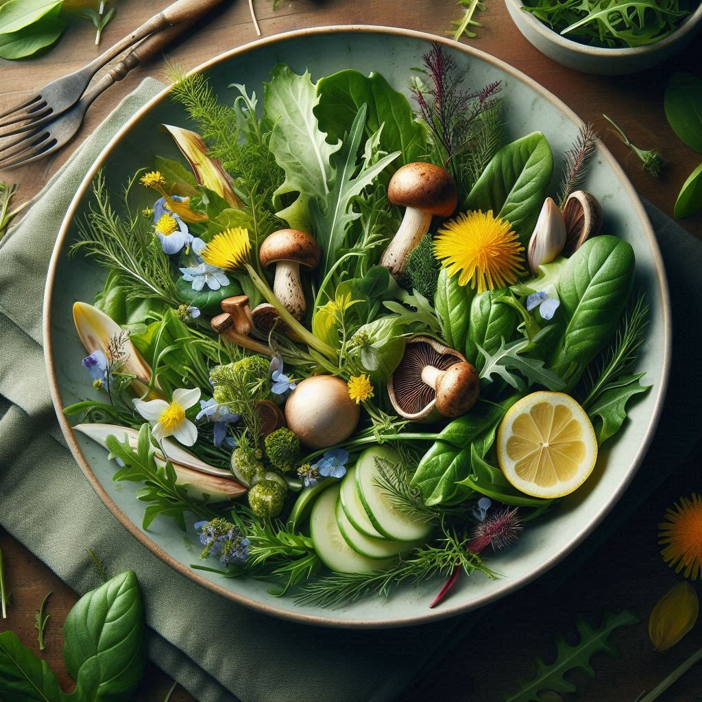
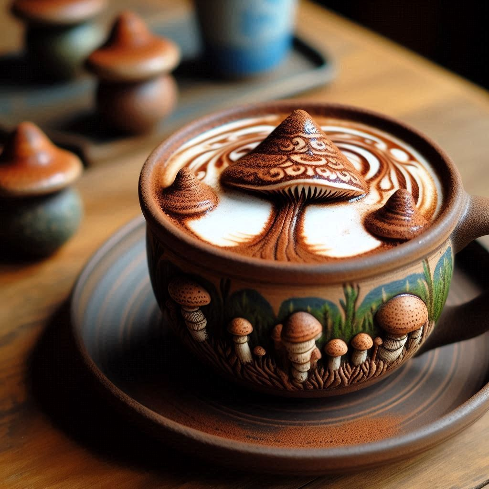

# 연습5: 메뉴 계획

원본: https://learn.microsoft.com/ko-kr/training/modules/explore-generative-ai-copilot-bing/6-exercise-plan-menu

## 첫번째 프롬프트 예시

```
현재 작업중인 목적지에서 제공할 음식 메뉴에 대해 생각해보고자 합니다. 프로젝트에서 이 부분은에 대한 명칭은 '음식'이라고 부르겠습니다. 메뉴를 표 형식으로 만들어 주세요. 표에는 메뉴명과 설명이 포함되어야 합니다. 설명에는 메뉴의 재료와 더불어 메뉴가 제공되는 방식이 명확하게 드러나야 합니다. 또한 메뉴명과 설명은 이 목적지의 테마를 반영해야 합니다. 5가지 아이디어를 제안해 주세요.
```

## Microsoft Copilot 답변 예시

물론입니다! 이 목적지의 테마를 반영한 음식 메뉴를 표 형식으로 제안해드릴게요.

| 메뉴명 | 설명 |
|--------|------|
| **숲의 향기 샐러드** | 신선한 숲속 채소와 허브로 만든 샐러드입니다. 야생 루꼴라, 민들레 잎, 그리고 숲속에서 채취한 버섯이 어우러져 자연의 향기를 느낄 수 있습니다. 레몬 비네그레트 드레싱과 함께 제공됩니다. |
| **고공 그릴 플래터** | 나무 가지 위에서 구운 다양한 고기와 채소 플래터입니다. 숯불에 구운 소고기, 닭고기, 그리고 제철 채소가 포함되어 있으며, 허브와 마늘 소스와 함께 제공됩니다. |
| **비밀의 정원 파스타** | 숲속에서 자란 신선한 재료로 만든 파스타입니다. 야생 버섯, 시금치, 그리고 토마토가 어우러진 크림 소스 파스타로, 파마산 치즈와 함께 제공됩니다. |
| **자연의 선물 스프** | 숲속에서 채취한 재료로 만든 따뜻한 스프입니다. 야생 버섯, 감자, 당근, 그리고 허브가 어우러진 스프로, 바삭한 빵과 함께 제공됩니다. |
| **숲속 베리 디저트** | 숲속에서 자란 다양한 베리로 만든 디저트입니다. 블루베리, 라즈베리, 그리고 딸기가 어우러진 타르트로, 바닐라 아이스크림과 함께 제공됩니다. |

이 메뉴들이 목적지의 테마를 잘 반영하면서도 방문객들에게 특별한 미식 경험을 제공할 수 있을 것입니다. 어떤 메뉴가 가장 마음에 드시나요? 😊


## 두번째 프롬프트 예시
```
제안해준 메뉴 중 첫 번째 메뉴에 대한 이미지를 생성해주세요.
```

## Microsoft Copilot 답변 예시


## 세번째 프롬프트 예시
```
시그니처 음료는 이 목적지의 테마를 진정으로 담아내는 특별한 음료입니다. 독창적이어야 하며 그 자체로 하나의 경험이 되어야 합니다. 지역 재료나 문화, 혹은 테마에서 영감을 받아 음료의 외관, 제공 방식, 또는 제조 방법에 반영될 수 있습니다. 이러한 음료는 고객에게 큰 기쁨을 선사합니다. 즐기기에 재미있는 독창적인 음료 아이디어를 구상하기 위해 영감을 줄 수 있는 사진을 찾아야 합니다. 색상, 재료, 제공되는 용기, 제조 과정, 또는 즐기는 방식 등에서 창의적인 음료들의 사진을 제공해 주세요.
```

## Microsoft Copilot 답변 예시
여기 몇 가지 창의적인 음료 아이디어를 위한 영감을 줄 수 있는 사진들을 찾아보았습니다:

1. **버터플라이 피 플라워 칵테일**: 이 칵테일은 나비콩 꽃을 사용하여 색이 변하는 매력을 가지고 있습니다. 파란색에서 보라색으로 변하는 이 음료는 시각적으로도 놀라움을 선사합니다⁴.

2. **갤럭시 매직 뮬**: 이 음료는 나비콩 꽃으로 만든 보라색과 파란색의 색상 변화를 특징으로 합니다. 또한, 톡 쏘는 얼음이 추가되어 어두운 곳에서도 빛나는 효과를 줍니다⁵.

3. **블러드 오렌지 샴페인 뮬**: 블러드 오렌지와 샴페인을 결합한 이 음료는 화려한 빨간색을 자랑하며, 라임 주스와 진저 비어가 더해져 상큼한 맛을 냅니다⁴.

4. **파이어크래커 칵테일**: 수박, 라임, 오이의 조합으로 만들어진 이 음료는 신선하고 달콤한 맛을 자랑합니다. 화려한 장식이 더해져 시각적으로도 즐거움을 줍니다⁵.

5. **샴페인 칵테일**: 크렘 드 비올렛과 샴페인, 레몬, 식용 꽃으로 장식된 이 칵테일은 간단하면서도 우아한 매력을 가지고 있습니다⁵.

이 사진들이 시그니처 음료를 구상하는 데 도움이 되길 바랍니다. 각 음료의 색상, 재료, 제공되는 용기, 제조 과정 등을 참고하여 독창적인 음료를 만들어 보세요! 😊

⁴: [DineWithDrinks](https://dinewithdrinks.com/best-unique-cocktails)
⁵: [StyleCaster](https://stylecaster.com/feature/creative-cocktail-recipes-1137200/)

Source: Conversation with Copilot, 10/1/2024

(1) 30 Unique Cocktails That Will Satisfy Your Thirsty Soul. https://dinewithdrinks.com/best-unique-cocktails

(2) Creative Cocktail Recipes: 15 Ways To Be Your Own Mixologist - StyleCaster. https://stylecaster.com/feature/creative-cocktail-recipes-1137200/

(3) 74 Easy Cocktail Recipes For The Most Satisfying Sips In 2024. https://www.brit.co/easy-cocktail-recipes/

(4) Top 5 Creative Cocktail Drink Ideas. https://www.notquitenigella.com/2021/09/26/top-5-cocktail-drink-ideas/

(5) Magical Color Changing Cocktails (Galaxy Cocktail). https://www.theflavorbender.com/magical-color-changing-cocktails-galaxy-cocktails/

(6) Our Top 10 Most Creative Cocktail Ideas - Recipes.net. https://recipes.net/articles/our-top-10-most-creative-cocktail-ideas/

## 네번째 프롬프트 예시
```
우리는 시그니처 음료에 대한 아이디어를 구상해야 합니다. 이 음료는 목적지의 테마를 반영하면서 사람들에게 놀라움과 기쁨을 선사해야 합니다. 제공되는 용기도 중요하며, 유리잔이나 그릇은 독특해야 하고 목적지의 테마를 담아야 합니다. 모든 사람을 아우를 수 있도록 세 가지 시그니처 음료나 음료 아이디어를 제안해 주실 수 있나요? 또한, 각각의 이름이 테마를 반영하면서도 기발하게 지어졌으면 합니다.
```

## Microsoft Copilot 답변 예시
```
물론입니다! 이 목적지의 테마를 반영하면서도 독창적이고 기발한 시그니처 음료 세 가지를 제안해드릴게요.

1. 에메랄드 포레스트 엘릭서
설명: 이 음료는 신선한 허브와 녹색 채소로 만든 건강한 주스입니다. 민트, 바질, 시금치, 그리고 사과가 어우러져 상쾌한 맛을 자랑합니다. 음료는 나무로 만든 컵에 제공되며, 컵의 외관은 나무 껍질을 닮아 자연과의 조화를 이룹니다. 음료 위에는 작은 꽃잎이 장식되어 있어 시각적으로도 아름답습니다.

2. 마법의 버섯 라떼
설명: 이 음료는 버섯 추출물과 아몬드 우유로 만든 따뜻한 라떼입니다. 버섯의 깊은 풍미와 아몬드 우유의 부드러움이 어우러져 독특한 맛을 선사합니다. 음료는 작은 도자기 컵에 제공되며, 컵의 디자인은 숲속의 버섯을 연상시키는 형태로 제작되었습니다. 음료 위에는 시나몬 가루로 나무 모양이 그려져 있습니다.

3. 숲속의 요정 칵테일
설명: 이 칵테일은 나비콩 꽃으로 만든 파란색 음료로, 레몬 주스를 넣으면 보라색으로 변하는 마법 같은 효과를 자랑합니다. 진, 레몬 주스, 그리고 나비콩 꽃 시럽이 어우러져 상큼하고 달콤한 맛을 냅니다. 음료는 투명한 유리잔에 제공되며, 잔의 바닥에는 작은 LED 조명이 있어 음료가 빛나는 효과를 줍니다. 음료 위에는 식용 꽃이 장식되어 있어 마치 요정의 음료를 마시는 듯한 느낌을 줍니다.

이 세 가지 시그니처 음료는 각각의 독특한 맛과 시각적 요소로 방문객들에게 놀라움과 기쁨을 선사할 것입니다. 어떤 음료가 가장 마음에 드시나요? 😊
```

## 다섯번째 프롬프트 예시
```
두번째로 제안한 마법의 버섯 라떼 음료를 시각화해서 보여주세요.
```

## Microsoft Copilot 답변 예시


## 핵심 개념 복습

- Copilot은 표 형태로 서식을 지정해서 결과물 반환 가능

- 반환된 표는 엑셀 파일 형식으로 다운로드 가능

- Copilot은 웹 상의 있는 콘텐츠를 기반으로 답변 생성 가능
  
- Copilot을 통해 연구하고, 브레인스토밍하고, 콘텐츠 생성까지 모두 가능 
